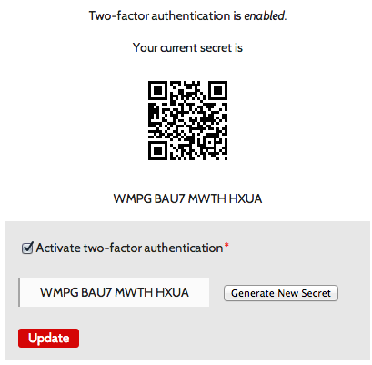

<!--
Title: Funding
-->

# Funding a Feature #

You may push the priority of the following features by donating to them directly. Just mention the feature when you [donate](donate).

## Two-Factor Authentication ##

300 € of 300 € – 
*Funded on 2018-07-02 - implementation in progress*

  <!-- div style="width: 100%; height: 100%; background: orange;" -->
  

  

 

Protect your account with [two factor authentication](http://en.wikipedia.org/wiki/Multi-factor_authentication). Use a third party App like [Duo Mobile](https://play.google.com/store/apps/details?id=com.duosecurity.duomobile) or [Google Authenticator](https://itunes.apple.com/en/app/google-authenticator/id388497605?mt=8) as a second factor to improve your security when logging in.

You don't have to enter your security token manually. The forum will provide a QR-Code you will be able to scan with your mobile device:

Two-factor authentication is especially valuable for administrator and moderator accounts and/or if you can't protect your login with https.
