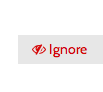
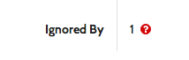
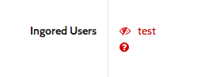

<!--
title: Saito 4.2 released
template: whats-new
date: 2014-08-16
author: Schlaefer
-->

Saito 4.2 introduces a user ignore feature. To ignore a user click the ignore button in the user's profile page:

On the profile page is also shown how many members ignore that user. For example this user is ignored by one other user:

In his own profile a member sees  who he ignores. This user ignores the user "test":

